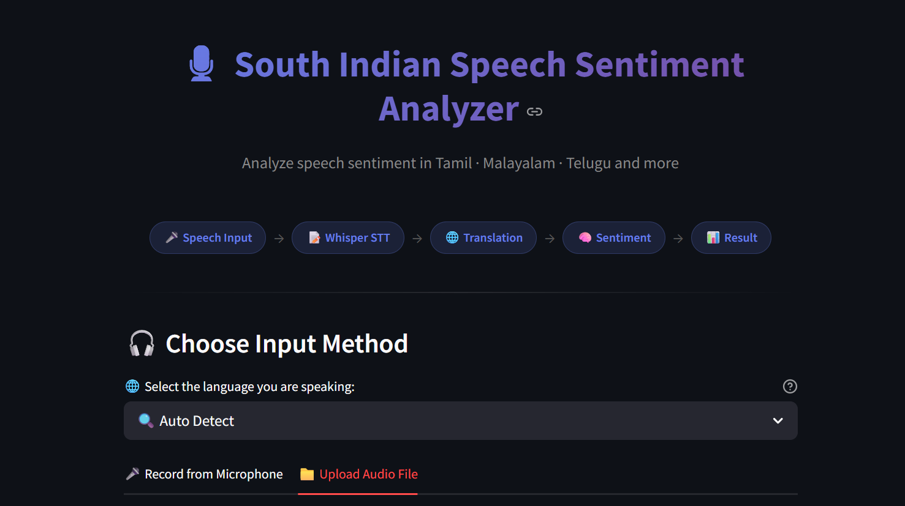
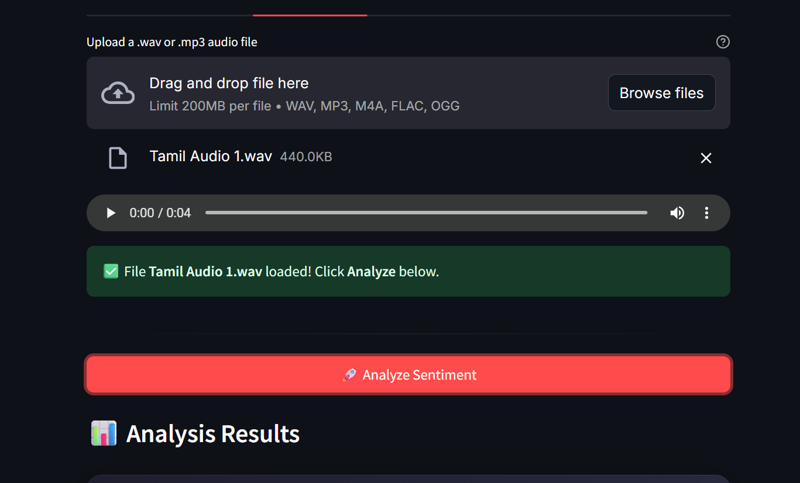
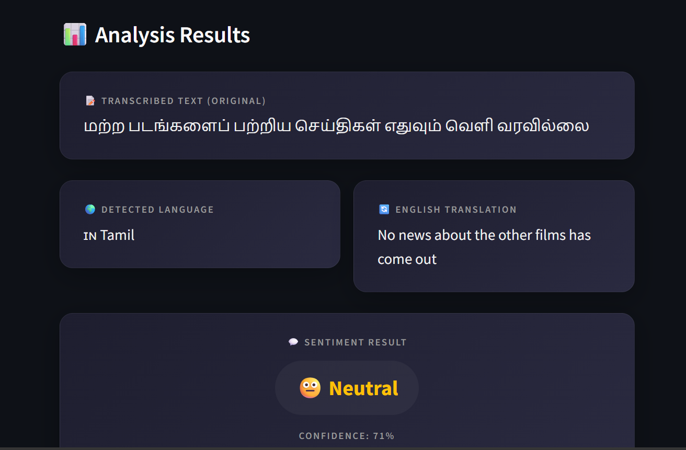

# 🎙️ Voice Meets Emotion

A real-time multilingual Speech-to-Text and Sentiment Analysis system developed using OpenAI Whisper and Hugging Face Transformers.

---

## 📖 Overview

Voice Meets Emotion is an AI-powered application that converts speech into text, detects the spoken language, translates it into English when required, and predicts the sentiment of the speaker.

The application supports multiple South Indian languages including Tamil, Telugu, Malayalam, and Kannada.

---

## 🚀 Features

- 🎤 Record audio using microphone
- 📁 Upload audio files
- 📝 Speech-to-Text using OpenAI Whisper
- 🌍 Automatic Language Detection
- 🔄 English Translation
- 😊 Sentiment Analysis
- 📊 Confidence Score Prediction
- 💻 Interactive Streamlit Web Interface

---

## 🛠️ Technologies Used

- Python
- Streamlit
- OpenAI Whisper
- Hugging Face Transformers
- PyTorch
- Google Translator
- NumPy
- FFmpeg

---

## 🌐 Supported Languages

- Tamil
- Telugu
- Malayalam
- Kannada
- Hindi
- English

---

## ▶️ Installation

```bash
pip install -r requirements.txt
```

---

## ▶️ Run the Project

```bash
streamlit run speech_sentiment.py
```

---

## 📸 Application Screenshots

### 🏠 Home Page



### 📤 Upload Audio



### 📊 Analysis Result



---

## 👩‍💻 Author

**Yazhini Anbarasan**

B.Tech Artificial Intelligence and Data Science
